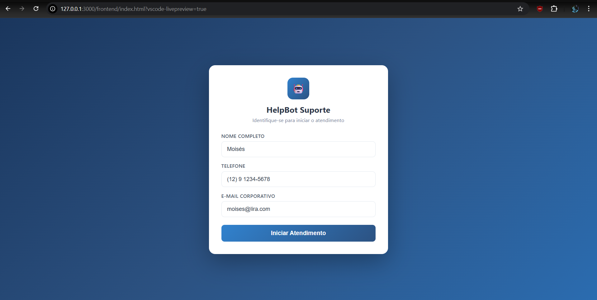
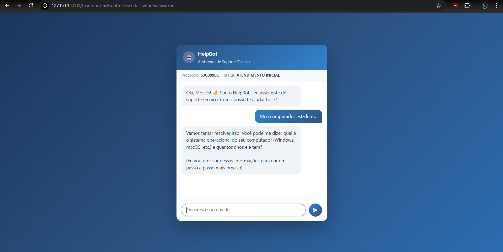
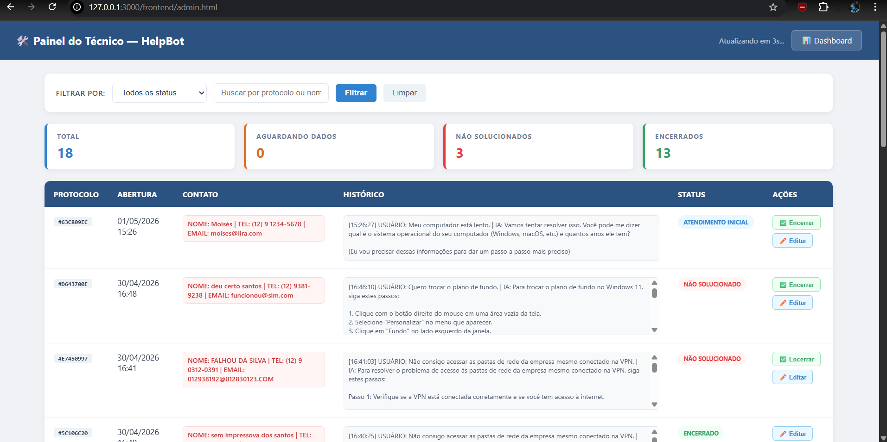
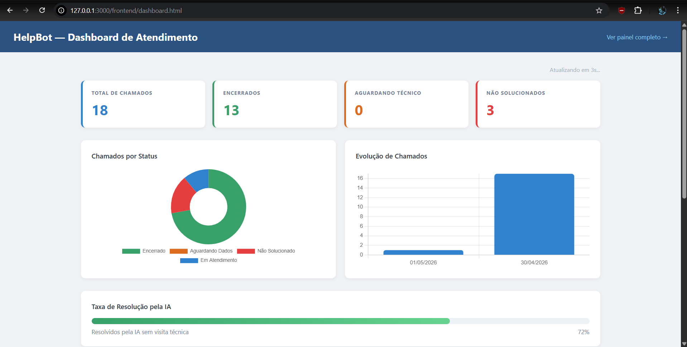
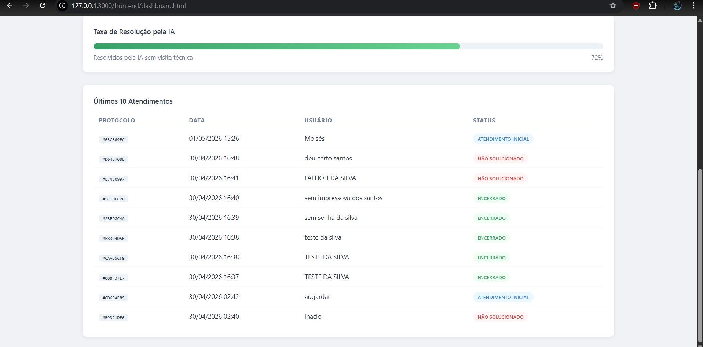

# 🤖 HelpBot — Assistente de Suporte Técnico com IA

> Sistema de service desk inteligente com RAG (Retrieval-Augmented Generation) que busca soluções em manuais técnicos reais, gerencia chamados e aciona técnicos automaticamente quando necessário.


---

## 📸 Screenshots

### Tela de Login e Identificação


### Chat de Atendimento


### Painel do Técnico


### Dashboard de Métricas


### Histórico de Atendimentos


---

## 🧠 Como funciona

O HelpBot utiliza a técnica de **RAG (Retrieval-Augmented Generation)** para responder chamados de suporte técnico:

1. O usuário descreve o problema no chat
2. O sistema busca os trechos mais relevantes nos manuais técnicos em PDF usando **ChromaDB**
3. O contexto encontrado é enviado junto com a pergunta para o modelo de IA (**Llama 4 via Groq**)
4. A IA responde com base nos manuais reais — não inventa respostas
5. Se o problema não for resolvido remotamente, o sistema solicita a localização do usuário e registra um chamado para visita técnica
6. O técnico visualiza todos os chamados em tempo real no painel administrativo

---

## ✨ Funcionalidades

- **Chat com IA** — atendimento automatizado com histórico de conversa completo
- **RAG com PDFs** — respostas baseadas em manuais técnicos reais indexados
- **Fluxo inteligente** — tenta resolver remotamente antes de acionar técnico
- **Abertura automática de chamado** — registra localização e envia para técnico
- **Timer de inatividade** — encerra atendimentos sem resposta automaticamente
- **Painel do técnico** — visualização em tempo real com filtros, edição e encerramento manual
- **Dashboard de métricas** — gráficos de chamados por status, evolução e taxa de resolução
- **Base de conhecimento expansível** — basta adicionar novos PDFs e reindexar

---

## 🗂️ Categorias de suporte disponíveis

| Categoria | Tópicos |
|---|---|
| Rede e Conectividade | WiFi, Ethernet, DNS, VPN corporativa |
| Hardware e Periféricos | Impressoras, monitor, teclado, mouse, superaquecimento |
| Software e SO | Windows 11, BSOD, Windows Update, recuperação do sistema |
| Microsoft 365 | Outlook, Teams, OneDrive, Word, Excel, licenças |
| VPN e Acesso Remoto | Conexão VPN, RDP, pastas de rede, split tunneling |
| Active Directory | Login corporativo, senhas, permissões, perfil de usuário |

---

## 🛠️ Stack tecnológica

| Camada | Tecnologia |
|---|---|
| Backend | Python 3.11 + FastAPI |
| IA | Groq API + Llama 4 Scout |
| RAG / Busca semântica | ChromaDB + DefaultEmbeddingFunction |
| Banco de dados | SQLite |
| Extração de PDF | pypdf |
| Frontend | HTML + CSS + JavaScript puro |
| Gráficos | Chart.js |
| Variáveis de ambiente | python-dotenv |

---

## 📁 Estrutura do projeto

```
helpbot/
├── api/
│   ├── main.py          # Backend FastAPI — rotas e lógica principal
│   └── claude.py        # Integração com IA e RAG
├── rag/
│   ├── indexer.py       # Indexação dos PDFs no ChromaDB
│   └── searcher.py      # Busca semântica nos chunks
├── database/
│   └── db.py            # Conexão e queries SQLite
├── frontend/
│   ├── index.html       # Interface de chat do usuário
│   ├── admin.html       # Painel do técnico
│   ├── dashboard.html   # Dashboard de métricas
│   └── chat.js          # Lógica do chat e timer de inatividade
├── pdfs/
│   ├── ti/              # Manuais de hardware e software
│   ├── rede/            # Manuais de rede e VPN
│   ├── office365/       # Manuais do Microsoft 365
│   ├── perifericos/     # Manuais de impressoras
│   └── infraestrutura/  # Manuais de Active Directory
├── chroma_db/           # Banco vetorial gerado automaticamente
├── .env                 # Chaves de API (não versionar)
├── .gitignore
├── requirements.txt
└── main.py              # Ponto de entrada da aplicação
```

---

## 🚀 Como executar localmente

### Pré-requisitos
- Python 3.11+
- Conta gratuita no [Groq](https://console.groq.com) para obter a API Key

### 1. Clone o repositório
```bash
git clone https://github.com/seu-usuario/helpbot.git
cd helpbot
```

### 2. Crie e ative o ambiente virtual
```bash
# Windows
python -m venv venv
venv\Scripts\activate

# Linux/Mac
python -m venv venv
source venv/bin/activate
```

### 3. Instale as dependências
```bash
pip install -r requirements.txt
```

### 4. Configure as variáveis de ambiente
Crie um arquivo `.env` na raiz do projeto:
```env
GROQ_API_KEY=sua_chave_aqui
```

### 5. Indexe os PDFs
```bash
python rag/indexer.py
```

### 6. Inicie o servidor
```bash
python -m uvicorn api.main:app --reload --port 8001
```

### 7. Acesse o sistema
Abra os arquivos da pasta `frontend/` no navegador:
- `index.html` — Chat de atendimento
- `admin.html` — Painel do técnico
- `dashboard.html` — Dashboard de métricas

---

## ➕ Como adicionar novos manuais

1. Coloque o PDF na pasta correspondente em `pdfs/`
2. Se for uma nova categoria, crie uma nova pasta dentro de `pdfs/`
3. Reindexe o banco vetorial:
```bash
python rag/indexer.py
```
4. Reinicie o servidor — o novo conteúdo já estará disponível para o chat

---

## 🔍 Rota de diagnóstico

Verifique se o RAG está funcionando corretamente acessando:
```
http://127.0.0.1:8001/diagnostico
```
Retorna o total de chunks indexados e um teste de busca semântica em tempo real.

---

## 📊 Fluxo de atendimento

```
Usuário abre chamado
        ↓
IA busca nos manuais (RAG)
        ↓
Tenta resolver remotamente com passo a passo
        ↓
Usuário confirma resolução → Chamado ENCERRADO ✅
        ↓ (se não resolveu)
IA solicita localização → Chamado AGUARDANDO TÉCNICO 🔧
        ↓
Técnico recebe no painel e realiza visita
        ↓
Chamado NÃO SOLUCIONADO (visita necessária) 📋
```

---

## 👨‍💻 Autor

**Moisés Lira** — Analista de TI | Automação & Infraestrutura

[](https://www.linkedin.com/in/liramoises)

---

## 📄 Licença

Este projeto está sob a licença MIT. Veja o arquivo [LICENSE](LICENSE) para mais detalhes.
